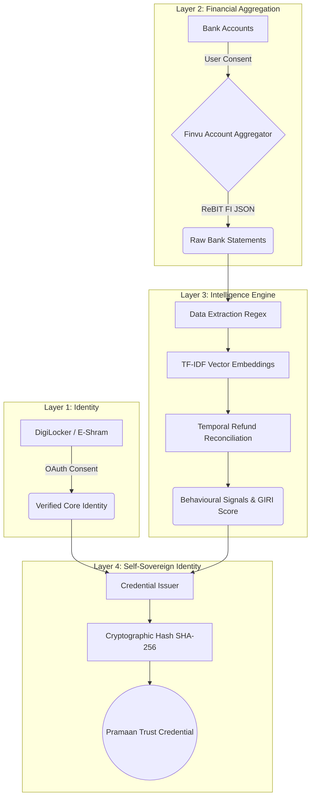

  
  
  # Pramaan: The Trust Engine for the Gig Economy
  
  **A 4-Layer Decentralized Identity and Financial Verification Platform built on the Account Aggregator (AA) framework.**

  
  
  
  
  
  [Demo](#) • [Architecture](#architecture) • [Features](#core-features) • [Installation](#local-setup)

---

## 🚀 The Problem
Over 15 million gig workers in India lack formal credit histories, making them invisible to traditional banking systems. Without formal salary slips, they face massive hurdles in obtaining loans, renting apartments, or proving their reliable income streams.

## 💡 The Solution
Pramaan is a **Verifiable Trust Engine** that bridges the gap between the informal gig economy and formal financial institutions. By leveraging India's Account Aggregator (AA) framework, Pramaan securely processes unstructured bank statements, extracts gig economy income patterns using mathematical Vector Embeddings, and issues a cryptographically verifiable **Self-Sovereign Identity (SSI)** Trust Credential.

---

## 🏗️ 4-Layer Architecture

Pramaan operates on a sophisticated 4-layer technical pipeline.

### Layer 1: Core Identity Verification
Integration with **DigiLocker** and **E-Shram** APIs to verify the foundational identity of the gig worker using a secure OAuth consent flow.

### Layer 2: Account Aggregation (FIP)
Integration with the **Finvu Account Aggregator** ecosystem. We securely fetch encrypted Financial Information (FI) payloads formatted according to the RBI-approved **ReBIT FI Data Schema**.

### Layer 3: The Intelligence Engine (Backend Core)
Our backend doesn't just read strings; it understands them.
- **Data Extraction Regex Pipelines:** Automatically extracts structural entities like UTRs (e.g., `CMS/123456`), UPI IDs, and reference numbers from noisy bank narrations.
- **Vector Embeddings (TF-IDF & Cosine Similarity):** Rather than relying on hardcoded dictionaries, narrations are converted to character N-Grams and mapped to vector spaces. Cosine similarity dynamically detects platforms (e.g., matching "ZOMATO GURGAON PAYOUT" to the "Zomato" signature vector).
- **Temporal Refund Reconciliation:** A deterministic state-tracking algorithm that differentiates a Payout (Credit) from a Refund (Credit) by mathematically linking it to a preceding Debit of the exact same amount.

### Layer 4: Cryptographic Trust (SSI)
The derived *Gig Income Reliability Index (GIRI)* and behavioural signals are packaged into a JSON object, hashed using **SHA-256**, and bound to a Decentralized Identifier (DID). This generates a tamper-proof **Pramaan Trust Card** and a verifiable PDF report for underwriters.

---

## ✨ Core Features
- **AI-Powered Financial Simulation:** Watch the Layer 3 Intelligence Engine extract signals live in the UI.
- **Dynamic Credential Export:** Generate Government-style PDF Underwriting Reports and verifiable Digital ID cards.
- **Privacy-First Consent:** Powered by the consent-driven Data Empowerment and Protection Architecture (DEPA).
- **Fraud Resistant:** Cryptographic hashes prevent PDF tampering.

---

## 🛠️ Local Setup

### Prerequisites
- Node.js (v18+)
- npm or yarn

### Installation
1. Clone the repository:
   \`\`\`bash
   git clone https://github.com/your-org/pramaan.git
   cd pramaan
   \`\`\`

2. Install dependencies:
   \`\`\`bash
   npm install
   \`\`\`

3. Set up environment variables (copy `.env.example` to `.env`):
   \`\`\`bash
   cp .env.example .env
   \`\`\`

4. Run the development server:
   \`\`\`bash
   npm run dev
   \`\`\`

5. Open [http://localhost:3000](http://localhost:3000) in your browser.

---

## 🤝 Contributing
Please see our [CONTRIBUTING.md](CONTRIBUTING.md) for details on our code of conduct, and the process for submitting pull requests to us.

## 📄 License
This project is licensed under the MIT License - see the [LICENSE](LICENSE) file for details.

  <i>Built with ❤️ for the Gig Economy of India.</i>

